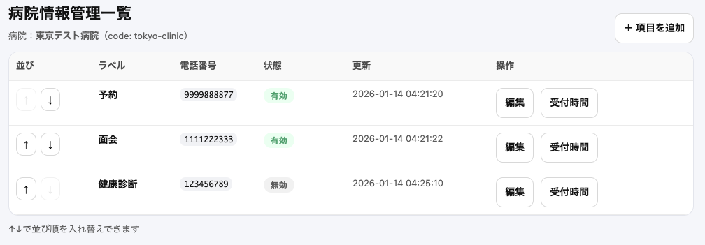

# Dux Call（病院連絡支援システム）

## 0.1.1 管理画面の追加修正。項目の並び替えに対応

  

QR コードで病院を登録し、  
**「今、電話できるか」が一目で分かる**  
患者向け病院連絡支援システムです。

PHP（XAMPP）＋ React（Vite）で構築し、  
スマートフォン実機での動作確認済み。

---

## 制作物概要

- 複数病院の連絡先を一覧管理
- 病院毎に追加したい連絡先を登録可能。

  

- 曜日別受付時間・例外日（休診等）に対応

  

- 高齢者を想定したシンプルな UI 設計

---

## 工夫した点

- 病院側の管理画面の画面追加及び UI の修正。

---
